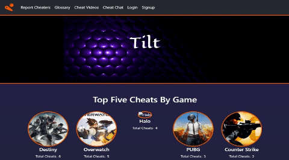
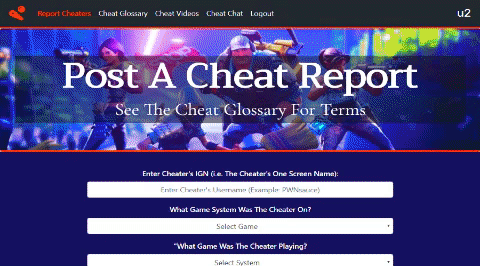
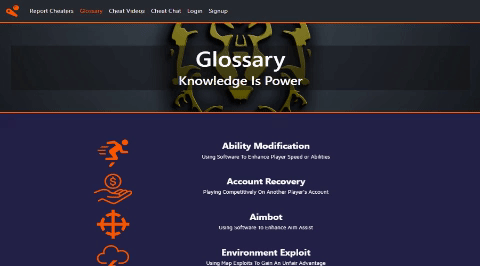
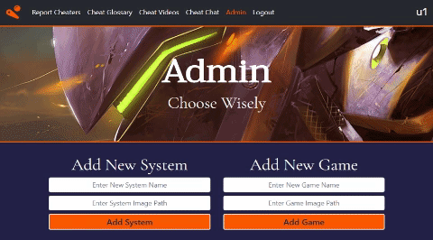
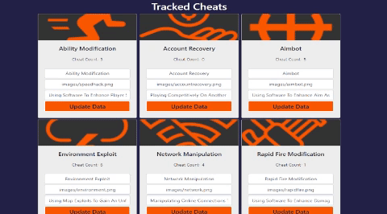
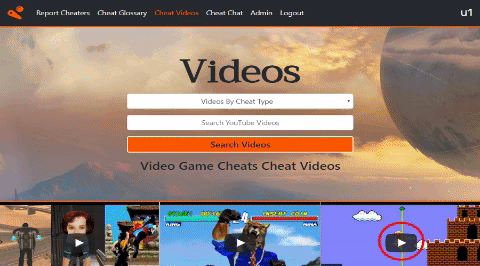
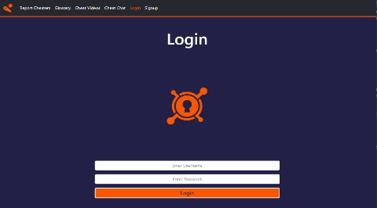
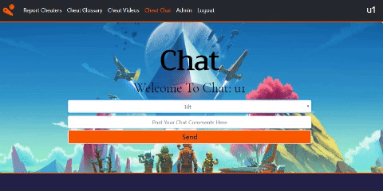

# Tilt

Track and report online gaming cheaters.

[Live Version of Tilt App](https://intense-brushlands-62905.herokuapp.com/)

## Description

Tilt is a MERN stack application which provides a way to report online gaming cheaters. With the growth of the online gaming industry, video game cheating has evolved and acquired various forms. Aimbot, sabotage, as well as network manipulation, and account recovery are but a few of the ways gaming cheaters alter results. To address this core issue, which will likely expand in the near future, the Tilt app provides a detailed reporting system that tracks online game cheaters, their methods, and their frequency among other valuable pieces of data.

In addition, Tilt includes a social media interface through which users can share relevant videos on gamecheats. There is also a chat feature; users can join "cheat chat" forums and exchange information.

## How Tilt Works

The user is presented with a summary page which presents a variety of information regarding game cheats. First, the page displays the top five cheats by game. Second, the front page presents cheats by system. Third, Tilt presents a graphical radial chart which outlines the ways in which users are cheating. Lastly, a user can track an online game cheater by searching a player's IGN.

If a player a encounters an online game cheater, the user can post a game cheat report. The procedure to post is to enter the cheaters one screen name or IGN. Then, through a series of drop down menus, the user selects which game system the cheater was playing, which game, and what method was utilized. Optionally, the player can post a video link and/or comments associated with the game cheat.

For online players unfamiliar with popular game cheating terms, there is also a glossary section.

Importantly, Tilt also provides special features for a user with administrator privileges. Upon entering the site as an administrator, an `Admin` section appears. The admin can add and update categories. For instance, an admin can add systems, games and cheat types to be tracked. These items later appear on the dropdowns in the `Post` section. Also, in the section chat forums can be added.

As part of the admin panel, tracked systems can be followed or updated. This is also true for monitored cheat types and video games. Another Tilt admin feature includes the search for cheaters by IGN. Additionally, the admin can update chat forum names or delete a forum.

The videos section gives the user the capability of searching for youtube clips about online game cheats. The user can select the types of gamecheat content to view. Subsequently, the topic videos are displayed in a quilt-like layout. On clicking the youtube card, the visual and audio are rendered.

Tilt also has authentication features such as signup and login. In order to post, a user must register with the site. If a non registered visitor attempts to access the post report screen or admin route, the user is redirected to the signup or login page.

Both procedures include validation checks on front end and back end.

There is a multi room chat available designed to exchange information about video games and possible cheats. Each chat forum is dedicated to a specific game. An administrator has the ability to delete chat content in case there are innappropriate conversations. The default chat room is the Tilt chatroom.

However, the user has the option of switching to other chat forums by selecting from the dropdown menu. Pertinent messages appear in the chat window as to a user has joined or left a chat forum.

## Main Technologies Used

* Front end:

1. React (react, react-dom, react-modal, react-router-dom)

2. Javascript

3. Bootstrap 4

4. CSS and HTML

5. react-vis

6. moment

7. react-youtube

8. socket.io-client

9. axios

* Backend:

1. node express, express-session to handle routes and sessions.

2. mongoose to store tables.

3. axios to handle requests

4. bcrypt

5. googleapis

6. socket.io

7. moment

8. others: body-parser, concurrently, connect-mongo,
    create-react-app, dotenv, if-env, nodemon

## Installation

The Tilt app can be cloned and installed following the procedure below.

1. Now we are ready to clone this app by running the following command. `git clone git@github.com:SigmaVX/Tilt.git` Note that if `git` and `node` need to be installed, the steps to do so are the following: a) git must be installed. [Download git.](https://git-scm.com/downloads) and b. nodejs must also be installed. [Download nodejs](https://nodejs.org/en/download/)

2. Since this file makes use of several node modules, please run `npm install`.  This installs all of the dependencies. Note that this command will install server side node dependencies as well as client side node packages utilized by react.

3. `Tilt` is a full stack app that uses nodejs and express on the back end. It needs to be deployed to on a platform that provides (like Heroku) "back-end" support. [Guide to deploying a Node Web Server on Heroku](https://github.com/RutgersCodingBootcamp/RUTSOM201801FSF4-Class-Repository-FSF/blob/master/13-express/Supplemental/HerokuGuide.md)

4. It is also necessary to setup MongoDB for Tilt. This services is provided by mLabs on heroku. In other words, the mLabs dependency needs to be added to the heroku app. Please refer to the following guide available from the heroku developers website. [Guide](https://devcenter.heroku.com/articles/mongolab#adding-mlab-as-a-heroku-add-on)

## Comments

The source code for the app is available on the following github repository:
[Repo](https://github.com/SigmaVX/Tilt)

A link to the Tilt app on heroku:
[Tilt](https://enigmatic-reef-11009.herokuapp.com/)
